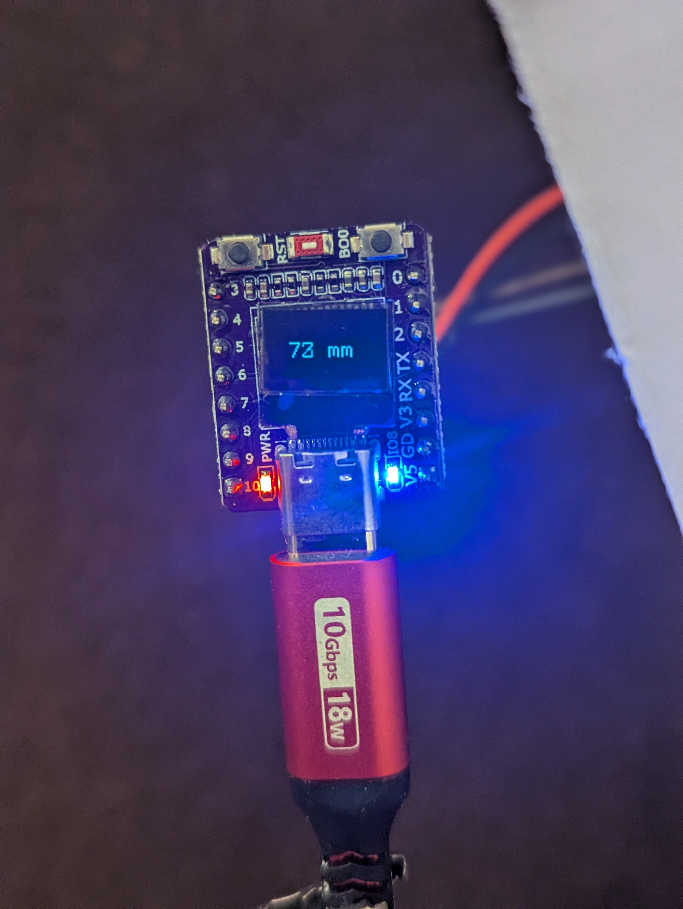
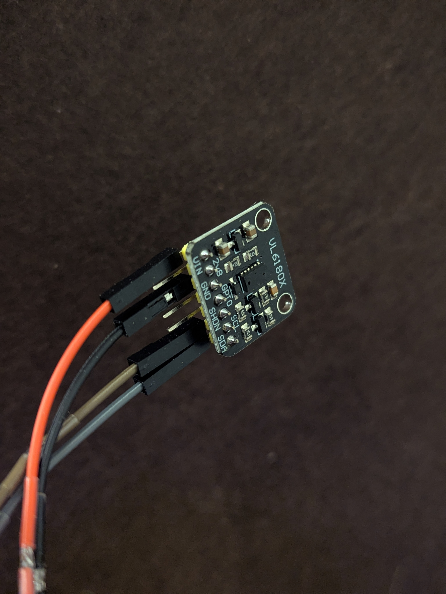

# h1 Simple Demo project for distance measurement

# h2 Short description
The project demonstrates distance measurement using rust on ESP32C3 using VL6180x TOF sensor.
The measured value is displayed on a 0,42" mini OLED display.

The purpose of this project is demonstrating something in Rust on the ESP32C3, that actually does
something "useful". Acquiring and displaying measured distance values on a display is at least something 
you can show to interested people...

Also the project was created as a small "hands on rust" exercice by the author (Fabian Tietz).

By no means this project is created to be used in a productive environment. The VL6180X driver is very basic 
and missing proper error handling for chip internal error conditions.

Possible hardware errors like i2c communication issues, failed hardware,... are also not handled.
(If handling such errors is possible at all on embedded devices...) 

# h2 Hardware details
A cheap chinese ESP32C3 board is used, which already includes a small 0,42" oled display connected
via I2C (address 0x3C).

The TOF Sensor VL6180x is also connected via I2c (Address 0x29). The I2c bus is shared for those two devices.

# h3 ESP32C3 development board with tiny oled display 

# h3 ST microelectronics vl6180x TOF sensor 
